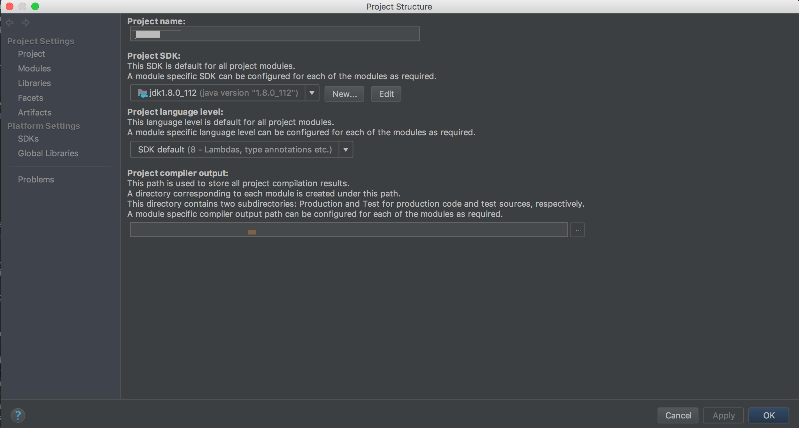
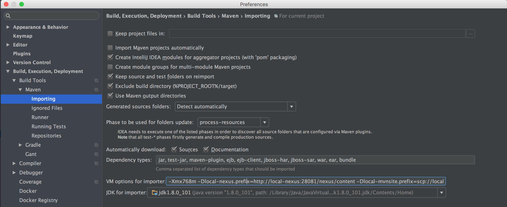

# 如何构建oss-build或贡献代码

## 搭建开发环境 (Mac OS X El Capitan)

##### 设置Docker for Mac

##### 建议你建立一个干净的目录(用于创建Eclipse的workspace或Intellij的project), 这里假设它叫`oss`.

>注意`oss`下不要混入其它项目, 否则构建gitbook或启动本地git服务时可能会出现问题.

>启动本地git之前一定要确保本地的oss-build项目有master分支.
  因为我们的项目使用gitflow, 默认分支都是develop, master分支只放production ready的代码.
  构建时需要到oss-build的git仓库下载配置文件, 通常指向master分支.
  所以要保证master分支被push到本地git服务.

>如果忘记了启动之前需要master分支, 可以通过以下任意一种方法补救
  1.pull下来master分支并重启本地git服务
  2.执行`(cd oss-build; git push local-git master:master;)` 

  自动设置oss开发环境
  via curl
  `sh -c "$(curl -fsSL https://github.com/Yirendai/oss-build/raw/master/src/main/install/install_oss_on_mac.sh)"`
  via wget
  `sh -c "$(wget https://github.com/Yirendai/oss-build/raw/master/src/main/install/install_oss_on_mac.sh -O -)"`
  
  它会自动进行下列操作:
  
  检查必备工具的版本, 自动安装或提示你手动安装
  
  自动配置环境变量

> TODO 为什么要配置环境变量?
  配置环境变量为上策, 修改本地settings.xml为下策
  
  设置maven等构建工具

  将oss全套项目和配置repo逐个clone到`oss`目录下
  
  构建项目, 启动docker容器

##### 安装IDE插件

  + IntelliJ插件         Lombok (And enable annotation processing)
  + IntelliJ&Eclipse插件 Grep Console
  + 其他插件请参考[oss-build的代码规范](./CODESTYLE.html)

##### 配置IntelliJ IDE的Maven runner和importing的VM参数

  执行`oss-vmopts`命令, 复制输出的内容, 粘贴到下面图示处.
  
  
  注意, 此截图仅表示配置的位置, 配置内容以文档为准, 务必完整配置.

##### 在IntelliJ中以maven module导入这些项目, 最好不要导入成多个project(多个窗口).

##### 在Eclipse中以maven project导入这些项目.

  Eclipse不支持直接设置maven的VM参数, 但可以通过设置JVM参数(需重启才能生效), Launch script (Run Configuration)的VM参数 解决问题.
  
另外也可以在本地的(~/.m2) settings.xml 中写properties来指定这些变量(需刷新Eclipse的maven配置或重启才能生效).

## 发布oss-build快照到maven仓库

  整体发布

    mvn -U ${DEPLOY_REPOSITORY} clean install deploy
    
  分步发布

    # 发布root pom的快照
    mvn -U -N ${DEPLOY_REPOSITORY} clean install deploy
    # 发布oss-dependency的pom的快照
    (cd oss-dependency && mvn -U ${DEPLOY_REPOSITORY} clean install deploy)

## 本地安装oss-build

  整体本地安装

    mvn clean install
    
  分步本地安装

    # 离线本地安装 root pom
    mvn -N clean install
    # 本地安装oss-dependency的pom
    (cd oss-dependency && mvn clean install)

## jira gitlab集成

maven site 构建时增加参数 

    jira.projectKey         # jira上的projectKey
    jira.user               # jira用户名
    jira.password           # jira密码

